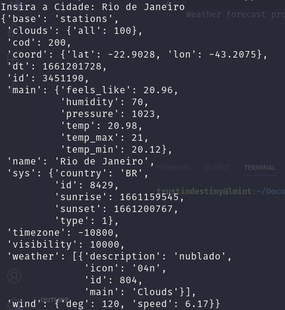

#Consultando o clima em Python.
Aprendendo um pouco sobre o uso de API's, decidi fazer um projeto simples e bem clichê de consulta a condições climáticas.
##Consulting the weather in Python.
Learning a little about using API's, I've decided make a simple project and cliché to consult weather conditions.

Libs: request and pprint.

#####Running:
